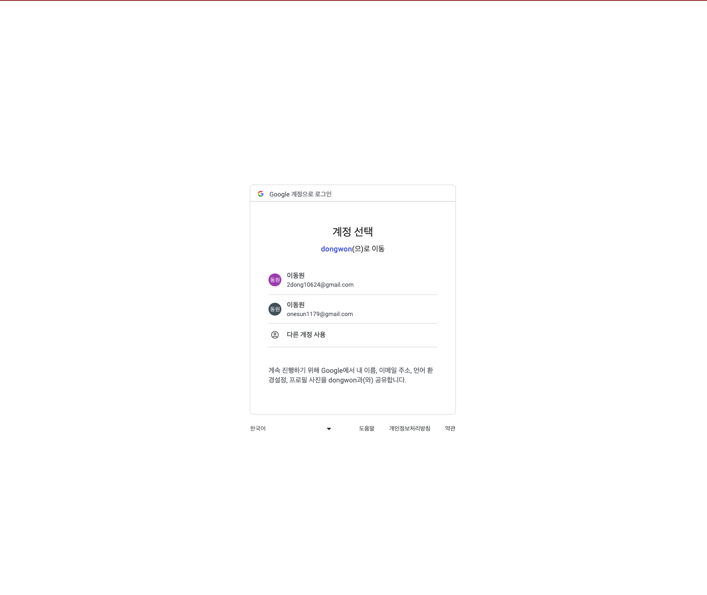

# Admin Tool - 토이프로젝트 (미완성)
사용 기술 : typescript Nestjs, vite, react, zustand, graphql, antd

## 개요
+ 개발자로서 서비스 전체를 개발할 능력이 있어야함. (FE 외 전문성은 없더라도..) 
+ BE툴은 고정적으로 두고 메뉴, 화면만 추가하여 FE 개발에 투자.

## 기능
+ 메세지, 코드, 아이콘 등 정적인 자원 동적 편성 기능
+ 권한별로 메뉴, 경로(paht), Component(react) 편성 기능

### 구글 oauth 로그인 화면 - redirectUrl방식

### 메세지 관리 화면

### 권한별_컴포넌트_관리

### 메뉴_관리

### 코드_관리

